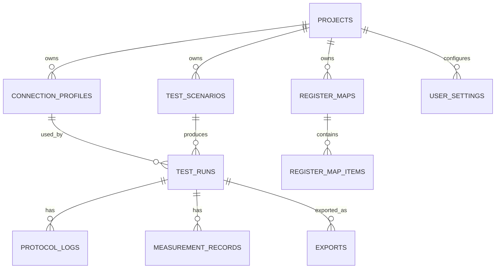
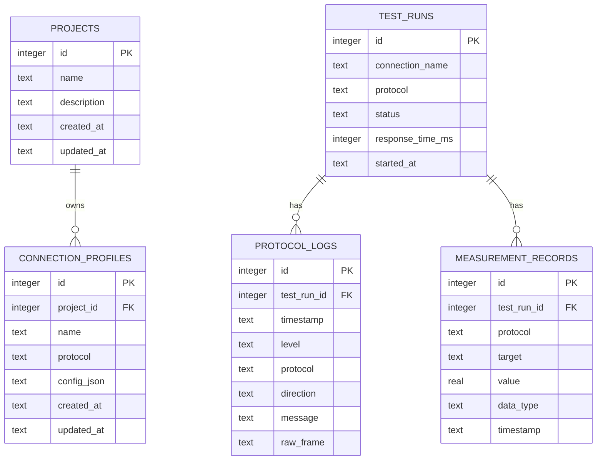

# AIO-ICPT 데이터 모델 기준 문서

이 문서는 AIO-ICPT의 ERD와 저장 전략을 정의한다. 데이터 모델은 기능 구현 전에 먼저 검토해야 하며, schema 변경 후에는 이 문서를 반드시 갱신한다.

## 1. 데이터 모델링 원칙

AIO-ICPT의 데이터 모델 전략은 **Core ERD 고정 + JSON 확장**이다.

의미:

- 프로젝트, 연결 프로파일, 테스트 실행, 로그, 측정값처럼 핵심 관계가 있는 데이터는 관계형 테이블로 고정한다.
- 프로토콜별 설정, 시나리오 step, protocol metadata처럼 형태가 달라질 수 있는 데이터는 JSON 필드로 확장한다.

이 전략을 선택한 이유:

- 핵심 데이터는 안정적으로 조회하고 관계를 추적할 수 있어야 한다.
- Modbus, MQTT, OPC UA처럼 설정 구조가 다른 프로토콜을 수용해야 한다.
- 완전 유연 스키마는 기준이 흐려지고 테스트가 어려워진다.
- 완전 고정 스키마는 새 프로토콜마다 migration 부담이 커진다.

## 2. 최종 핵심 엔티티

최종 제품 기준의 핵심 엔티티는 다음과 같다.



### 2.1 projects

목적: 테스트 작업의 최상위 단위.

주요 필드:

- `id`
- `name`
- `description`
- `created_at`
- `updated_at`

### 2.2 connection_profiles

목적: 프로토콜별 연결 설정 저장.

주요 필드:

- `id`
- `project_id`
- `protocol`
- `name`
- `config_json`
- `created_at`
- `updated_at`

`config_json`은 Modbus TCP, Modbus RTU, MQTT, OPC UA처럼 프로토콜마다 다른 설정을 저장한다.

### 2.3 test_scenarios

목적: 반복 가능한 테스트 자동화 시나리오 저장.

주요 필드:

- `id`
- `project_id`
- `name`
- `protocol`
- `scenario_json`
- `created_at`
- `updated_at`

`scenario_json`은 step 목록, expected value, retry, polling interval, response time 조건을 저장한다.

### 2.4 test_runs

목적: 테스트 실행 이력 저장.

주요 필드:

- `id`
- `project_id`
- `connection_profile_id`
- `scenario_id`
- `status`
- `started_at`
- `finished_at`
- `total_steps`
- `success_count`
- `failure_count`
- `average_response_time_ms`

단일 테스트도 하나의 `test_runs`로 기록한다.

### 2.5 protocol_logs

목적: 테스트 실행 중 발생한 structured log와 raw frame 저장.

주요 필드:

- `id`
- `test_run_id`
- `connection_profile_id`
- `timestamp`
- `level`
- `protocol`
- `direction`
- `message`
- `raw_frame`
- `metadata_json`

`metadata_json` 후보:

- function code.
- address.
- unit/slave id.
- exception code.
- transaction id.

### 2.6 measurement_records

목적: 프로토콜 작업에서 얻은 decoded value 저장.

주요 필드:

- `id`
- `test_run_id`
- `protocol`
- `target`
- `value`
- `raw_value`
- `data_type`
- `unit`
- `timestamp`
- `metadata_json`

scale factor를 도입하면 raw value와 scaled value를 분리할지 별도 ADR로 결정한다.

### 2.7 register_maps

목적: 장비별 register/tag 정의 묶음 저장.

주요 필드:

- `id`
- `project_id`
- `connection_profile_id`
- `name`
- `description`
- `created_at`
- `updated_at`

### 2.8 register_map_items

목적: 개별 address/register/tag 정의 저장.

주요 필드:

- `id`
- `register_map_id`
- `name`
- `address`
- `function_code`
- `data_type`
- `byte_order`
- `word_order`
- `scale`
- `unit`
- `description`
- `metadata_json`

### 2.9 user_settings

목적: 앱 설정과 사용자 환경 저장.

주요 필드:

- `id`
- `scope`
- `key`
- `value_json`
- `updated_at`

예:

- 기본 export 경로.
- 로그 보관 정책.
- 기본 timeout.
- Mock server 설정.

### 2.10 exports

목적: export 실행 이력 저장.

주요 필드:

- `id`
- `test_run_id`
- `format`
- `file_path`
- `status`
- `created_at`
- `metadata_json`

## 3. 현재 구현 테이블

현재 SQLite 구현은 첫 수직 슬라이스를 위한 최소 테이블만 포함한다.



현재 테이블은 최종 ERD의 축소판이다. `projects`와 `connection_profiles.project_id`는 Phase 2에서 추가되었다. `test_runs.connection_profile_id`, `scenario_id`, `metadata_json` 같은 필드는 아직 구현되지 않았다.

## 4. 현재 테이블 정의

### 4.1 projects

목적: 테스트 작업의 최상위 단위.

현재 필드:

- `id`: primary key.
- `name`: 사용자 표시 이름.
- `description`: 프로젝트 설명.
- `created_at`: 생성 시각.
- `updated_at`: 수정 시각.

현재 제한:

- 아직 프로젝트별 test run/history 관계는 연결되지 않았다.
- 최근 프로젝트 표시는 별도 settings 저장 없이 `updated_at` 정렬을 사용한다.

### 4.2 connection_profiles

목적: 재사용 가능한 프로토콜 연결 설정 저장.

현재 필드:

- `id`: primary key.
- `project_id`: 소유 프로젝트.
- `name`: 사용자 표시 이름.
- `protocol`: 프로토콜 id. 현재 `modbus-tcp`.
- `config_json`: 프로토콜별 연결 설정.
- `created_at`: 생성 시각.
- `updated_at`: 수정 시각.

현재 Modbus TCP 설정 예:

```json
{
  "host": "127.0.0.1",
  "port": 1502,
  "unitId": 1,
  "timeoutMs": 1000
}
```

### 4.3 test_runs

목적: 프로토콜 테스트 실행 1회를 저장.

현재 필드:

- `id`: primary key.
- `connection_name`: 실행 시점의 연결 이름.
- `protocol`: 프로토콜 id.
- `status`: `success` 또는 `failure`.
- `response_time_ms`: 응답 시간.
- `started_at`: 실행 시각.

현재 제한:

- connection profile은 project에 연결되지만 test run은 아직 profile id를 저장하지 않는다.
- 단일 read operation 기준의 단순 run 정보만 저장한다.

### 4.4 protocol_logs

목적: structured log와 raw frame 저장.

현재 필드:

- `id`: primary key.
- `test_run_id`: 부모 test run.
- `timestamp`: 로그 시각.
- `level`: `TRACE`, `DEBUG`, `INFO`, `WARN`, `ERROR`, `RAW`.
- `protocol`: 프로토콜 id.
- `direction`: `TX`, `RX`, `NONE`.
- `message`: 사람이 읽는 메시지.
- `raw_frame`: raw frame hex string.

현재 제한:

- function code, address, transaction id는 아직 `metadata_json`으로 분리되지 않았다.

### 4.5 measurement_records

목적: 프로토콜 작업 결과로 얻은 decoded value 저장.

현재 필드:

- `id`: primary key.
- `test_run_id`: 부모 test run.
- `protocol`: 프로토콜 id.
- `target`: 대상. 현재 예: `holding-register:0`.
- `value`: decoded numeric value.
- `data_type`: 현재 `uint16`.
- `timestamp`: 측정 시각.

현재 제한:

- `unit`, `raw_value`, `metadata_json`은 아직 없다.

## 5. 향후 추가 테이블

우선순위가 높은 추가 테이블:

- `projects`
- `test_scenarios`
- `register_maps`
- `register_map_items`
- `user_settings`
- `exports`

추가 시점:

- `projects`: Phase 2.
- `test_scenarios`: Phase 5.
- `register_maps`, `register_map_items`: Data Monitor 또는 Modbus data type 확장 시점.
- `user_settings`: Settings 화면 또는 export path 설정 도입 시점.
- `exports`: CSV/JSON Export 도입 시점.

## 6. JSON 확장 규칙

JSON 필드를 사용해도 되는 경우:

- 프로토콜별 연결 설정.
- 시나리오 step 세부 정보.
- 프로토콜별 metadata.
- 아직 자주 검색하지 않는 확장 정보.
- 외부 SDK나 벤더별 추가 정보.

JSON 필드를 사용하면 안 되는 경우:

- primary key.
- foreign key.
- 자주 필터링하는 status.
- 정렬/검색에 자주 쓰는 timestamp.
- protocol id.
- log level.
- direction.
- test run status.

JSON 내부 값이 자주 필터링되거나 join 기준이 되면 별도 컬럼으로 승격한다. 이때 migration 계획과 ADR을 작성한다.

## 7. 마이그레이션 규칙

Schema 변경 규칙:

1. `data-model.md`를 먼저 갱신한다.
2. repository 테스트를 먼저 작성한다.
3. migration 또는 `CREATE TABLE` 변경을 구현한다.
4. 기존 데이터와의 호환성을 검토한다.
5. schema 변경 이유가 중요하면 ADR을 작성한다.

저장소 원칙:

- SQLite는 기본 저장소이다.
- PostgreSQL은 선택 저장소이다.
- 외부 DB가 없어도 MVP 기능은 동작해야 한다.
- SQLite와 PostgreSQL의 차이는 Repository/Adapter 경계에서 흡수한다.
